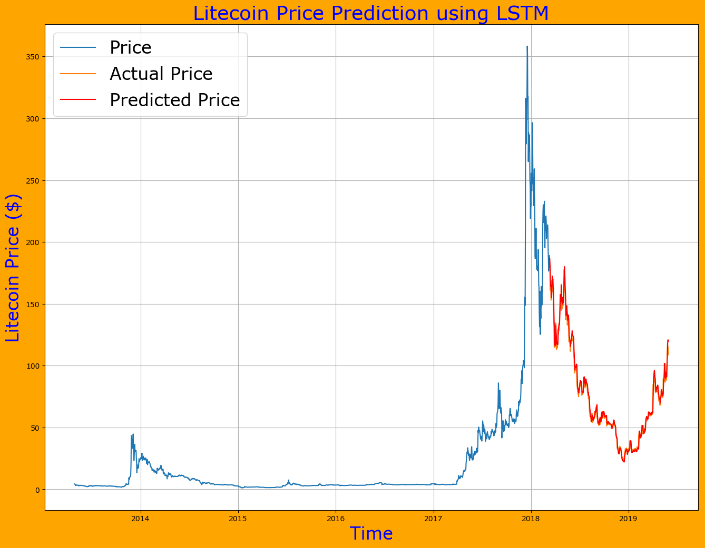

This script can be used to predict price of cryptocurrency which is listed on CoinMarketCap. 

## Example 
I have tested this script for Bitcoin, Ethereum, and Litecoin. 
```
$ python price_predict.py bitcoin 20130428 20190530

```


``` 
$ python price_predict.py ethereum 20130428 20190530

```


```
$ python price_predict.py litecoin 20130428 20190530

```




Reference: [Analytics Vidhya](https://www.analyticsvidhya.com/blog/2018/10/predicting-stock-price-machine-learningnd-deep-learning-techniques-python/)

## Disclaimer: 
```
All content provided here, is for your general information only, procured  from third party sources.
I make no warranties of any kind in relation to this content, including but  not limited to accuracy
and updatedness. No part of the content that I provide  constitutes  financial  advice, legal advice 
or any other form of advice meant for your specific reliance for any purpose. Any use or reliance on
my content is solely at your own risk  and  discretion. You should conduct your own research, review, 
analyse and  verify my content  before relying  on them. Trading is a highly risky activity that can 
lead to  major  losses, please  therefore  consult your financial advisor before making any decision.
No content on this Site is meant to be a solicitation or offer.
```
